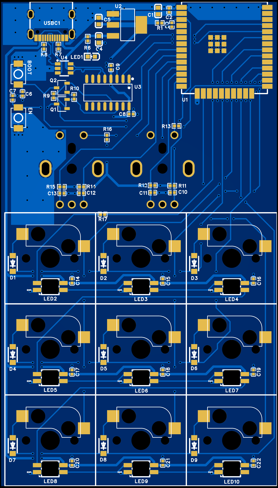
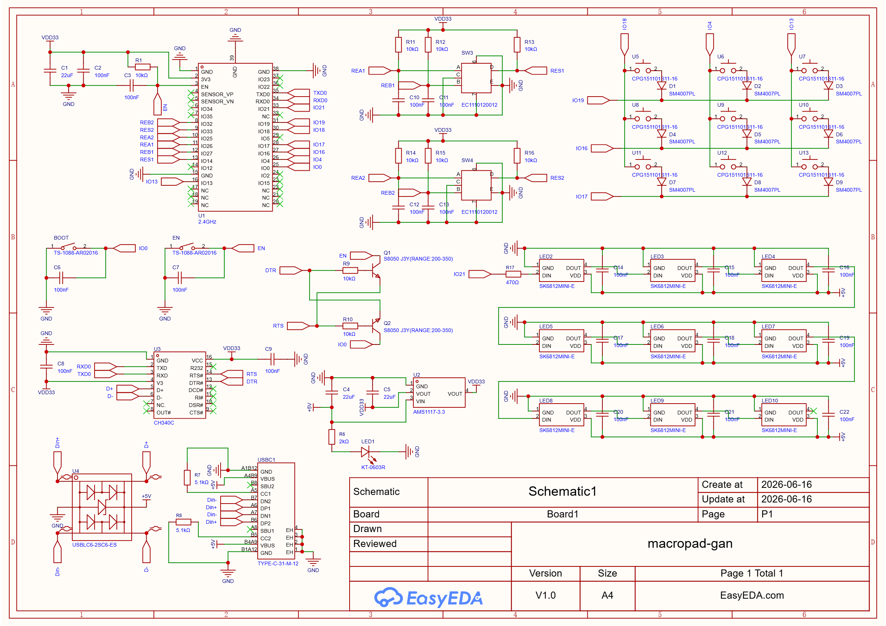
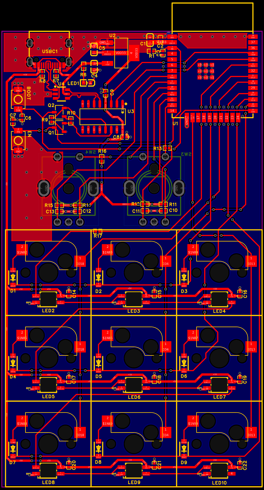
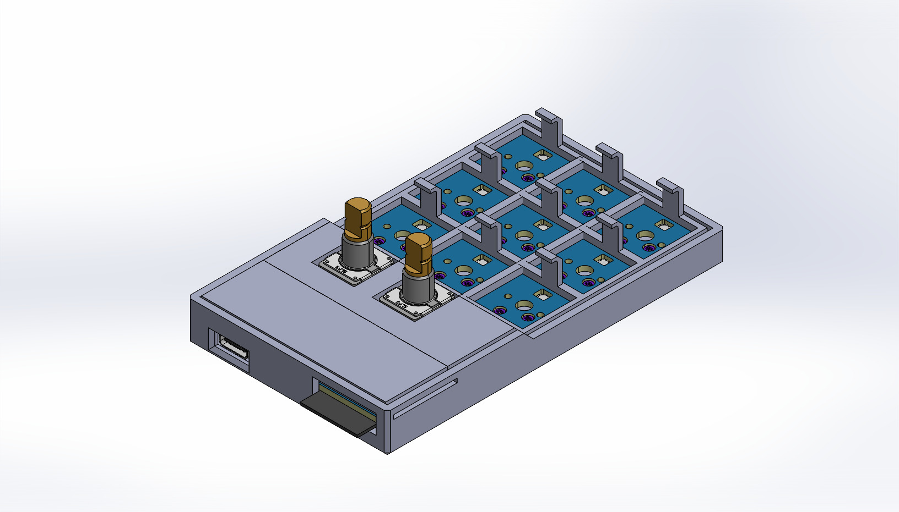
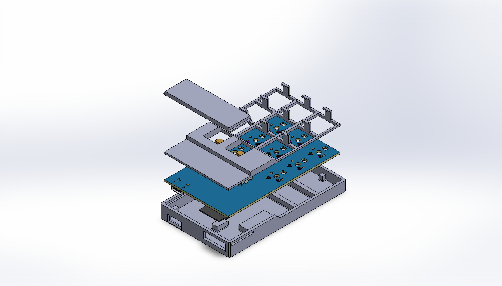

# ESP32 BLE Macropad



## Overview
A custom 3x3 hardware macropad firmware powered by an ESP32 micro-controller, featuring dual rotary encoders, persistent NVS flash storage, and interactive Serial CLI configuration.

---

## Key Features

* **BLE Human Interface Device (HID):** Emulates a wireless Bluetooth keyboard using the `BleKeyboard` library.
* **3x3 Matrix Keypad:** Utilizes dynamic row-column scanning with multi-key modifier combination detection (allows declaring keys as either modifier holdings or action triggers).
* **Combo Keys & Layering Support** Allows physical pad buttons to be configured as Modifiers or Action keys. Supports holding single or multiple modifier keys on the pad to trigger layered multi-key macro combinations (up to 5 output HID keys per combo).
* **Dual Rotary Encoders:** Configured via `ESP32Encoder` using hardware PCNT tracking for volume controls, media navigation, and mute toggles.
* **On-the-Fly Serial CLI:** Allows users to map custom keyboard shortcuts, configure modifier rules, and monitor button matrices directly via the Arduino Serial Monitor without re-flashing.
* **Non-Volatile Storage (NVS):** Automatically saves modifier states and shortcut combination maps to onboard flash memory using `Preferences.h`.

---

## Hardware

### Schematics




> **Core Circuit Summary:** USB-C powered ESP32 macropad featuring an auto-reset UART flashing circuit, a 3x3 key matrix with anti-ghosting diodes, dual rotary encoders with pushbuttons, and a daisy-chained SK6812MINI-E addressable RGB LED array (optional).

---

#### **1. Power & USB Interface**

* **USB Interface:** USB-C connector protected with a USBLC6-2SC6-ES ESD protection array on the $D+ / D-$ lines.
* **Power Regulation:** Input $+5\text{V}$ from USB-C feeds an AMS1117-3.3 linear regulator to supply a stable $3.3\text{V}$ rail ($\text{VDD33}$) to the microcontroller.
* **Filtering & Indication:** $22\mu\text{F}$ and $100\text{nF}$ decoupling capacitors on the supply rails, featuring a dedicated red power indicator LED (LED1).

---

#### **2. Microcontroller & USB-to-UART Bridge**

* **Core Unit:** ESP32-WROOM module handles primary processing and wireless capabilities.
* **UART Communication:** CH340C USB-to-UART converter interfaces USB data directly to ESP32 hardware serial ports ($\text{TXD0} / \text{RXD0}$).
* **Auto-Reset / Flashing Circuit:** Dual S8050 NPN transistor circuit ($Q1, Q2$) driven by $\text{DTR} / \text{RTS}$ for automated flashing, backed by manual BOOT ($\text{IO0}$) and RESET ($\text{EN}$) tactile buttons with RC debouncing.

---

#### **3. Key Matrix Pinout (3x3 Grid)**

| Row / Line | Key Switches | Anti-Ghosting Diodes |
| --- | --- | --- |
| **Row 1** | U5, U6, U7 | D1, D2, D3 (SM4007PL) | 
| **Row 2** | U8, U9, U10 | D4, D5, D6 (SM4007PL) | 
| **Row 3** | U11, U12, U13 | D7, D8, D9 (SM4007PL) |

---

#### **4. Subsystem Breakdown**

**Dual Rotary Encoders (SW3 & SW4)**

* **SW3:** Encoder channels $A / B$ connected to **REA1** ($\text{IO25}$) & **REB1** ($\text{IO32}$), with integrated switch on **RES1** ($\text{IO14}$).
* **SW4:** Encoder channels $A / B$ connected to **REA2** ($\text{IO27}$) & **REB2** ($\text{IO33}$), with integrated switch on **RES2** ($\text{IO12}$).
* **Debouncing & Pull-ups:** Filtered with $10\text{k}\Omega$ pull-up resistors to $\text{VDD33}$ and $100\text{nF}$ RC capacitors on output channels.

**Addressable RGB LED Matrix** (Optional)

* **LED Array:** 9x SK6812MINI-E RGB LEDs daisy-chained from **IO21** via a $470\Omega$ series resistor.
* **Bypass Filtering:** Individual $100\text{nF}$ decoupling capacitors ($C14 - C22$) placed at every LED $+5\text{V}$ power pin.

---

### PCB Layout




> **Board Layout Overview:** A 2-layer, high-density layout featuring a distinct functional split: dense SMD processing/interface circuitry in the top section, and a spacious 3x3 key grid with integrated per-key SK6812MINI-E reverse-mount/underglow LEDs (optional) across the bottom. The board is designed upside down so most of the components are on the top layer.

---

#### **1. Board Specifications & Design Rules**

* **Layer Count:** 2-Layer Board (Top Layer: Red traces/pours, Bottom Layer: Blue traces/pours)
* **Form Factor:** Compact Macropad layout featuring 9 key switch footprints and dual rotary encoders
* **Copper Pours:** Dedicated ground ($GND$) planes on top and bottom layers for EMI shielding and thermal dissipation

---

#### **2. Layout & Zone Division**

**Processing & Power Zone (Top Half)**

* **USB-C & Interface:** USB-C connector situated at top-left with short, differential pair length-matched trace routing to ESD protection ($U4$) and CH340C ($U3$) serial bridge.
* **Voltage Regulator:** AMS1117-3.3 ($U2$) placed directly near the main power input with wide $+5\text{V}$ and $\text{VDD33}$ copper traces to handle current flow.
* **Control Buttons:** Tactile BOOT and RESET switches placed along the left board edge for quick flashing access.
* **Microcontroller Position:** ESP32-WROOM module ($U1$) occupies the top-right quadrant, oriented with its PCB antenna area positioned along the board edge to optimize wireless signal performance.

**Interactive Matrix Zone (Bottom Half)**

* **Key Matrix Layout:** Uniform $3\times3$ grid housing hot-swap / PCB-mount key switch footprints.
* **Component Placement:** Each key node integrates a dedicated anti-ghosting diode ($D1 - D9$) and a local $100\text{nF}$ bypass capacitor ($C14 - C22$).
* **RGB LED Integration:** SK6812MINI-E addressable LEDs ($LED2 - LED10$) mounted directly under each switch position with daisy-chained data routing running horizontally across the bottom layer.

---

#### **3. Routing & Signal Integrity Highlights**

* **Traces & Vias:** Heavy use of stitching vias around high-current supply nodes and ground planes to reduce loop inductance.
* **Bypass Capacitor Proximity:** Decoupling caps ($C1 - C5$, $C10 - C13$, $C14 - C22$) are placed immediately adjacent to their respective IC and LED power pins.
* **Signal Isolation:** Direct, clean trace runs on top/bottom layers cleanly separating high-speed USB data lines from low-frequency switch matrix lines.

---

## Firmware

```
                               +-----------------------------+
                               |        main.cpp / loop      |
                               +--------------+--------------+
                                              |
      +---------------------------------------+---------------------------------------+
      |                                       |                                       |
      v                                       v                                       v
+-----------------------+           +-----------------------+           +-----------------------+
|   handleSerial()      |           |     readMatrix()      |           |  ESP32Encoder / PCNT  |
|                       |           |                       |           |                       |
| Reads Serial stream   |           | Active-low GPIO scan  |           | Tracks Hardware       |
| into string buffer    |           | updates 16-bit mask   |           | Rotary Encoder steps  |
+-----------+-----------+           +-----------+-----------+           +-----------+-----------+
            |                                   |                                   |
            | Passes raw                        | Passes button state               | Rotated / Clicked
            | command lines                     | bitmask on change                 |
            v                                   v                                   v
+-----------------------------------------------------------------------------------------------+
|                                  Shortcut_Manager (Singleton)                                 |
|                                                                                               |
|  +--------------------------------+   +----------------------------------------------------+  |
|  |       parseCommand()           |   |                   update()                         |  |
|  |                                |   |                                                    |  |
|  | Parses CLI strings:            |   | Detects keypress state changes (pressed & !was)    |  |
|  |  - HELP / SHOW                 |   | Calls sendShortcut(currentButtonState)             |  |
|  |  - MODIFIER <btn>:<0/1>        |   +-------------------------+--------------------------+  |
|  |  - SET <combo>:<key_seq>       |                             |                             |
|  +---------------+----------------+                             | Output HID Keycodes         |
|                  |                                              |                             |
|                  | Syncs changes                                v                             |
|                  v                                +---------------------------+               |
|  +--------------------------------+               |       BleKeyboard         |               |
|  |    ESP32 Preferences (NVS)     |               |                           |               |
|  |                                |               | Sends keypresses/releases |               |
|  | Writes mod_mask & shortcuts    |               | wirelessly over Bluetooth |               |
|  | array to flash memory          |               +-------------+-------------+               |
|  +--------------------------------+                             |                             |
+-----------------------------------------------------------------|-----------------------------+
                                                                  |
                                                                  v
                                                     +--------------------------+
                                                     |       Host Computer      |
                                                     +--------------------------+
```

> Built on the Arduino framework for ESP32, integrating BLE HID keyboard functionality (`BleKeyboard`), hardware PCNT rotary tracking (`ESP32Encoder`), non-volatile storage configuration saving (`Preferences`), and a thread-safe Singleton manager for dynamic matrix key mapping.

---

### 1. Matrix Scanning Mechanism (`readMatrix`)

The 3x3 key matrix relies on standard active-low column scanning using internal GPIO pull-ups to track active key states efficiently into a single 16-bit bitmask (`buttonState`).

* **Pin Configuration:** Rows are assigned to outputs (`19`, `16`, `17`), while Columns use internal pull-up inputs (`13`, `4`, `18`).
* **Active-Low Scanning Loop:**
    1. The scanner iterates through each row, pulling it `LOW` while driving all inactive rows to floating high-impedance (`INPUT`).
    2. Columns are sampled using `digitalRead()`. A logic `LOW` on a column pin signals a closed switch connection.
    3. Pressed keys are recorded directly into an integer bitfield via bitwise shift operations: `currentScanState |= (1 << (j + i * ROWS))`.


* **State Change Detection:** Key evaluation triggers exclusively when the sampled state bitmask differs from `lastButtonState`, minimizing unnecessary polling overhead.

---

### 2. Singleton Pattern: `Shortcut_Manager`

The macro management system uses a thread-safe C++ Singleton pattern to guarantee a single global instance for non-volatile key mappings, serial console interactions, and HID output handling.

* **Singleton Implementation:** Encapsulates initialization logic with a private constructor and deleted copy/assignment operators (`Shortcut_Manager(const Shortcut_Manager&) = delete;`). The global reference is accessed safely via:
```cpp
Shortcut_Manager& manager = Shortcut_Manager::getInstance();

```


* **Bitfield State Engine:** Manages combinations by mapping the 9 physical matrix keys to a bitfield mask (`isKeyModifierMask`) and an array of target HID sequences (`shortcuts[TOTAL_COMBINATIONS][SC_LEN_MAX]`).
* **NVS Storage Integration:** Leverages ESP32 `Preferences` to write modifier masks and multidimensional macro mapping arrays directly into non-volatile Flash storage, retaining custom keybindings across power cycles.
* **CLI Engine:** Includes a built-in Serial terminal interpreter supporting runtime macro management via `HELP`, `SHOW`, `MODIFIER <btn>:<0/1>`, and `SET <combo>:<keys>` commands.

---

### 3. Hardware Encoders & BLE HID Integration

* **Hardware Pulse Counter (PCNT):** Uses `ESP32Encoder` configured with `attachHalfQuad` to handle quadrature decoding in hardware without losing pulses during loop execution.
* **Rotary Media Controls:**
    * Encoder 1 directly emits `KEY_MEDIA_VOLUME_UP` / `KEY_MEDIA_VOLUME_DOWN` keycodes, with its shaft button sending `KEY_MEDIA_MUTE`.
    * Encoder 2 tracks hardware position steps for custom user extensions.


* **BLE Connectivity:** Emulates a standard Bluetooth LE keyboard (`BleKeyboard`), broadcasting parsed multi-key sequences and consumer control signals wirelessly to connected host devices.

---

## Setup & Assembly Guide

### 1. PCB Ordering & Assembly

1. Download the latest release package containing the `Gerber`, `BOM` (Bill of Materials), and `CPL` (Component Placement List) files.
2. Upload the Gerber `.zip` file to your preferred PCB fabricator (e.g., JLCPCB, PCBWay).
3. Enable **SMD Assembly** service:
    * Upload `BOM.csv` and `CPL.csv` when prompted for component placement (covers the core SMD components and CH340C bridge).
    * Verify part orientations against the silkscreen preview before finalizing the order.


4. Once the board arrives, solder the remaining components:
    * **Required Through-Hole Parts:** EC11 Rotary Encoders are **not included** in the default BOM/CPL and require manual sourcing and soldering.
    * **Optional RGB Lighting:** The PCB layout supports SK6812MINI-E reverse-mount LEDs, but they are **not included** in the default BOM/CPL or stock firmware. If you choose to hand-solder them, you will need to add custom LED driving logic to your code.


---

### 2. Firmware Setup (PlatformIO)

1. **Clone the Repository:**
```bash
git clone https://github.com/chingkangggan/esp32-ble-macropad.git
cd esp32-ble-macropad/firmware

```


2. **Open in PlatformIO:**
* Open **VS Code** with the **PlatformIO IDE** extension installed.
* Select **File > Open Folder** and navigate directly to the `firmware` directory.
* *Note: All library dependencies (`ESP32 BLE Keyboard`, `ESP32Encoder`) and board configurations are already defined in `platformio.ini`, so no manual setup is required.*


3. **Flash the Firmware:**
* Connect your board via USB-C.
* Put the ESP32 into bootloader mode if auto-reset isn't triggered (hold `BOOT`, tap `RESET`, release `BOOT`).
* Click **PlatformIO: Upload** in the bottom toolbar, or run:
```bash
pio run --target upload

```

4. **Configure via Serial:**
* Open the PlatformIO Serial Monitor set to `115200` baud.
* Type `HELP` to view available CLI commands for assigning key combinations and modifiers.

---

## Serial CLI Configuration

The onboard Serial Command Line Interface allows real-time macro configuration, modifier toggling, and layout inspection directly through the PlatformIO or Arduino Serial Monitor without re-flashing the firmware.

### **1. Connection Settings**

* **Baud Rate:** `115200`
* **Line Ending:** Both `NL` & `CR` (`\r\n`)

---

### **2. Available Commands**

| Command | Syntax / Parameters | Description | Example |
| --- | --- | --- | --- |
| **`HELP`** | `HELP` | Displays the help menu with all available commands. | `HELP` |
| **`SHOW`** | `SHOW` | Prints the current modifier assignments and active macro combos stored in NVS flash. | `SHOW` |
| **`MODIFIER`** | `MODIFIER <btn_index>:<0/1>` | Configures a pad key as a Modifier holding key (`1`) or a standard Action trigger (`0`). | `MODIFIER 1:1` |
| **`SET`** | `SET <combo_mask>:<key_seq>` | Binds a single key or modifier combo bitmask to a sequence of up to 5 HID keycodes. | `SET 1+2:LCTRL+C` |

---

### **3. Step-by-Step Configuration Examples**

* **Setting a Dedicated Modifier Key:**
To turn Key `1` into a held layer modifier key:
```text
> MODIFIER 1:1
[OK] Key 1 set as MODIFIER.

```


* **Mapping a Multi-Key Macro Combo:**
To map holding Key `1` (Modifier) while pressing Key `2` to trigger `Ctrl + C` (Copy):
```text
> SET 1+2:LCTRL+C
[OK] Combo (1+2) mapped to [LCTRL, C]. Saved to NVS.

```


* **Inspecting Saved Layouts:**
```text
> SHOW
--- Active Configurations ---
Modifiers Bitmask : 0x0002 [Key 1]
Combos:
  [Key 1 + Key 2] -> LCTRL + C
  [Key 0]        -> KEY_MEDIA_VOLUME_UP

```

---

## 3D Printed Enclosure




> **Design Overview:** A custom, low-profile case designed in SolidWorks to house the populated PCB and mechanical switches securely. The enclosure features precise cutouts for the USB-C port, dual rotary encoders, and top-side tactile buttons.

---

### 1. Printing the STL Files

All 3D printable model files are located in the `/mechanical` folder.

| File | Quantity | Recommended Material | Description |
| --- | --- | --- | --- |
| **`top-cover.stl`** | 1 | PLA / PETG | Top plate securing the cover plate to the bottom enclosure |
| **`cover-plate.stl`** | 1 | PLA / PETG | Securing the PCB into the enclosure |
| **`macropad-enclosure.stl`** | 1 | PLA / PETG  | Main housing for PCB |

**Recommended Slicer Settings:**

* **Layer Height:** `0.2mm`
* **Infill:** `15% - 20%` (Grid or Gyroid)
* **Supports:** None required (designed for flat print orientations)

---

### 2. Final Assembly



1. **Place PCB in enclosure:** Insert PCB into `macropad-enclosure.stl`.
2. **Cover Plate:** Place `cover-plate.stl` on top of the PCB to secure it against the enclosure.
3. **Snap Fit Top Cover:** Snap fit `top-cover.stl` to secure the cover plate against the enclosure.

---

## Credits

Designed and developed by the **Technical Team** of the **IEEE Student Branch (26/27)** at the **University of Nottingham Malaysia**, as part of the **Sparks Initiative 26/27**.
